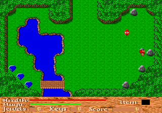
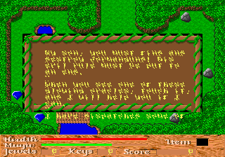

# God of Thunder — Sega 32X port

A port of the 1993 DOS game *God of Thunder* (Ron Davis / Adept Software) to
the Sega 32X, built from the public-domain source release plus the original
retail resource file.

Original source: https://github.com/SheridanR/god-of-thunder

**The compiled ROM lives at [`rom/got32x.32x`](rom/got32x.32x)** — 2 MB, a
self-contained Sega 32X cartridge image with every game asset embedded. No
external data file is needed.



---

## Quick start

```bash
bash setup.sh     # install SH-2 + 68000 toolchains (safe to re-run)
make              # build rom/got32x.32x
make test         # run the emulator test suite
```

Run `rom/got32x.32x` in any 32X-capable emulator (PicoDrive, Ares, Kega
Fusion, BlastEm) or on hardware via a flash cart.

### Controls

| 32X pad | Action                        | DOS original |
|---------|-------------------------------|--------------|
| D-pad   | Move Thor                     | Arrow keys   |
| B       | Swing hammer                  | Ctrl / Space |
| C       | Use selected magic            | Alt          |
| A       | Cycle inventory item          | Tab          |
| Start   | Options menu                  | Esc          |

---

## What had to be solved

### 1. The resource format was undocumented

`res_read()` — the function that reads every asset — is **commented out** in
the source release, and the resource manager it depended on (`res_man.h`) was
a third-party library that was never published. The 740 KB `GOTRES.DAT` was
effectively an opaque blob.

Reverse-engineering it yielded:

* a **256-entry directory**, XOR-encrypted with a *positional* key: byte *i*
  is XORed with `(0x80 + i) & 0xFF`;
* 23-byte records of `char name[9]; u32 offset; u32 size; u32 origSize;
  u16 key`;
* payloads compressed with an **LZSS variant that uses relative back-
  references** (`dest - offset`), not the usual ring buffer. This detail
  matters: every ring-buffer LZSS dialect decodes the first few hundred bytes
  correctly and then diverges, which is exactly the sort of bug that looks
  like a rendering problem later. ScummVM's GOT engine was used to confirm
  the exact dialect.

All **177 resources now decode losslessly**.

### 2. Two different pixel layouts in the same file

This one caused a visible bug mid-port. The file contains both:

* **Background tiles / pictures** (262-byte blocks: a 6-byte header then
  pixels) stored in **VGA Mode X plane order** — plane *p* holds every 4th
  pixel starting at column *p*. These must be de-planed.
* **Actor sprite frames** (bare 256-byte blocks, 16 per actor) stored
  **linearly**. The original blits them with a straight 256-byte copy.

De-planing the actor frames produced correct-looking *noise* — plausible
pixel values in the wrong places, so Thor rendered as static. The fix was to
confirm against the original `make_actor_surface()`/`xput` paths, which copy
sprite bytes through untouched.

### 3. Mode X → chunky framebuffer

The DOS game drove VGA Mode X: four planes, writes gated through the
Sequencer map-mask register, four hardware pages, and sprites pre-shifted
into **four separate plane alignments** with nibble-oriented masks
(`make_mask()` in `1_IMAGE.C`). That machinery is why the game had a hard cap
on actor frames — it ran out of VGA memory.

The 32X provides a linear 8-bit chunky framebuffer, so all of it collapses
into ordinary memory copies. There is no frame budget and no per-screen
upload. Assets are de-planed once at build time.

### 4. Screen height: 240 → 224

The DOS layout was 192 lines of play area plus a 48-line status panel, held
in place by the VGA split-screen (CRTC line-compare). NTSC 32X only displays
**224** lines (240-line mode is PAL-only).

Cropping the play area was not an option — the whole engine is built around a
12×20 grid of 16px tiles. Instead the play area stays **pixel-exact at
320×192** and the panel is compressed 48→32 lines. That compression is not a
blur: the panel art is drawn in 4-line bands, so dropping one row in four
reproduces it faithfully at ¾ height, with bar and text coordinates scaled to
match.

### 5. 16-bit `int` → 32-bit `int`

Turbo C's `int` was 16-bit. Every structure that is read directly out of
`GOTRES.DAT` (`LEVEL`, `ACTOR_NFO`, …) therefore uses explicit `s16`/`u16` in
this port. The on-disc layout is load-bearing, so it is pinned with
compile-time assertions in `src/got.h`:

```c
GOT_ASSERT(level_size, sizeof(LEVEL) == 512);
GOT_ASSERT(level_sobj, __builtin_offsetof(LEVEL, static_obj) == 322);
```

The comments in the original `1_DEFINE.H` were stale — they claimed
`static_obj` sat at offset 302, while the code that copies it uses **322**.
The assertions encode the layout the code actually relies on.

### 6. Tile collision has *inverted* polarity

The engine classifies background tiles by index, and the rule is the
opposite of what intuition suggests:

```c
#define TILE_SOLID    80
#define TILE_FLY     140   /* icon <  TILE_FLY    => solid, blocks walking */
#define TILE_SPECIAL 200   /* icon >  TILE_SPECIAL => scripted tile        */
```

**Low** indices are the solid scenery (trees, water, rock) and **high**
indices are open ground. Screen 23's grass is tile 176.

An early version of this port guessed the opposite (`140 <= icon < 200`
blocks), which marked the player's own spawn tile solid and walled Thor in
from the first frame — he would turn to face each direction but never take a
step. The fix was to port `check_move0()` faithfully, including its
four-probe foot box:

```
x1 = x + 1    y1 = y + 8     (feet, not centre - so Thor's head can
x2 = x + 12   y2 = y + 15     overlap scenery while he walks past it)
```

The two regression tests `player can move on both axes` and `player can walk
out and back` were added specifically for this, and were confirmed to fail
against the buggy build.

### 7. Direction codes are load-bearing

The engine's direction encoding is **0=UP, 1=DOWN, 2=LEFT, 3=RIGHT**
(`movement_zero()` / `movement_two()` in `1_MOVPAT.C`), and the same value
indexes `pic[dir][frame]`. An early version of this port used
`0=DOWN 1=UP 2=RIGHT 3=LEFT` — both axes inverted — which made Thor face one
way and walk the other, because the *facing* came from the sprite table
while the *displacement* came from the key handler.

They are now named constants (`DIR_UP` …) rather than bare literals.

### 8. The pad reader must handle the full TH handshake

The Genesis 3/6-button protocol delivers the D-pad, A/Start, and the
6-button extras on **different TH phases**. A hand-rolled reader here
silently dropped the B button, so the hammer never fired. It has been
replaced with Chilly Willy's / d32xr's proven `get_pad` sequence, which
returns `0 0 0 1 M X Y Z S A C B R L D U` (and `0xF000` for an empty port).

### 9. Most "scenery" is actually an actor with a func_num

This was the biggest missing piece. Crystal balls, money gates, pushable
blocks, boulders, barrels, signs, peasants, merchants, hags — and the
**trees** — are not background tiles. They are entries in
`scrn.actor_type[]`, i.e. actors, distinguished by a non-zero `func_num`
that indexes `special_movement_func[]`:

| func_num | actors on episode 1 | behaviour |
|---------:|---------------------|-----------|
| 1 | `BLOCK1`, `MOVEROCK` | pushable block |
| 2 | `REDANGEL`, `GRNANGEL` | angle block |
| 3 | `GLOBE` | crystal ball, runs a script |
| 4, 7 | `SWITCH`, `GGLOBE` | peg switches |
| 5 | `BOULDER` | boulder roll |
| 8, 9 | `HBARREL`, `VBARREL` | roll on one axis |
| 10 | `MAN1`, `MERCH`, `KID1`, `GIRL1`, `HAG1/2`, `WOM1/2`, `SIGN1..4`, `TR-UL/UR/LL/LR` | villagers, signs, trees |
| 255 | `FAKEBUSH` | walk-through decoy |

`check_move0()` dispatches to the handler on contact; a handler returning 0
blocks the move. Without that dispatch every one of these was walked
straight through, which is exactly the reported symptom.

Note `func_num` lives at **offset 32** of `ACTOR_NFO` (after the 9-byte
`name`). Reading it from the wrong offset yields plausible-looking garbage
(109, 114, …) rather than the 1–10 range, so the offsets are now pinned
with static assertions alongside `solid`, `type` and `size_x/y`.

### 10. Doors, gates and caves are special *tiles*

Tiles above `TILE_SPECIAL` (200) run `special_tile_thor()`:

| tile | meaning |
|-----:|---------|
| 201 | locked door — consumes a key |
| 202 | ending bridge |
| 203, 204, 212, 213 | always solid |
| 205–208 | one-way tiles (passable in a single direction) |
| 209 | money gate, 10 jewels |
| 210 | money gate, 100 jewels |
| 211 | end-of-level trigger |
| 214–217 | teleport pads (solid to Thor) |
| 218–229 | holes and cave mouths — jump to another screen |

The cave/hole handler only fires when Thor's *centre* is on the tile, and it
defers the actual screen change to the main loop via a `warp_pending` flag,
mirroring the original. Opening a door mutates the tile grid, so it also
invalidates the cached background.

### 11. LEVEL records contain little-endian 16-bit fields

`static_x[30]` / `static_y[30]` are `int` arrays written by Turbo C on x86,
so they are **little-endian**. The SH2 is big-endian and this port maps the C
struct straight onto the resource bytes, so an x of 2 read back as 512 and
every gem, potion and key was drawn far outside the play area — invisible,
and unreachable by the pickup test.

`tools/mkassets.py` now byte-swaps those halfwords when packing SDAT. This is
the same class of bug as the tile/sprite layout mismatch: the data is fine,
the *interpretation* has to match the machine.

### 12. Palette depth

`PALETTE` stores 8-bit components, but the VGA DAC only accepted 6 bits, so
the original shifted everything right by two before programming it. Missing
this produces a washed-out, wrongly-hued image. The port applies the same
`>> 2` and then packs to the 32X's RGB555 CRAM.

---

## Architecture

```
src/crt0.s      SH-2 boot, ROM header, exception vectors (from d32xr)
src/mars_hw.c   32X VDP: framebuffer, line table, CRAM, page flipping
src/gfx.c       chunky-pixel primitives, font, palette/fades, compositor
src/res.c       ROM-embedded resource archive, read in place
src/level.c     screen loading, tile rendering, dirty-screen tracking
src/actors.c    actor loading, frame binding, drawing
src/game.c      state, movement/collision, main loop
src/panel.c     status panel (48→32 line adaptation)
src/input.c     Genesis pad → engine buttons
src/sound.c     STUB — see below
src-md/md_main.s  68000 side: hardware init, pad polling, SH-2 handshake

tools/mkassets.py  GOTRES.DAT → linear, ROM-embeddable archive
tools/mkrom.py     pad to cartridge size, fix header checksum
tests/runner.c     headless libretro harness with scripted input
tests/run_tests.py point-to-point test suite
```

**Memory.** The 32X has 256 KB of SDRAM. Assets stay in ROM and are read in
place — the SH-2 can execute and read straight out of cartridge space — so the
1.3 MB of converted assets cost no RAM. Only mutable state is in SDRAM:
three page buffers (~138 KB) plus game state and a small dirty-screen cache.

**68000 ↔ SH-2.** The 68000 samples both pads every vblank and publishes them
to the SH-2 through the COMM mailbox (`COMM8`/`COMM10`), with a frame counter
in `COMM12`. No handshake is needed on the read path.

---

## Enemy AI, damage and dialogue

**Movement.** `src/move.c` ports `move_actor()` (the speed_count scheduler),
`check_move2()` (enemy collision against scenery, special tiles, other
actors and Thor) and the movement patterns episode 1 actually uses:

| pattern | behaviour | examples |
|--------:|-----------|----------|
| 1 | stand and animate | villagers, signs, trees |
| 3 | walk until blocked, turn randomly | `ARCHER`, `BEETLE`, `SKUNK` |
| 4 | track Thor | `BRUTUS`, `ELF`, `WOODY` |
| 7 | as 3, with pauses | `BOINGY` |
| 9 / 37 | straight runs of random length | `EAGLE`, rats |
| 10 | vertical patrol | `SPIDER` |
| 11 | diagonal drift | `BAT` |
| 15 | fully static | `BOULDER`, `FAKEBUSH` |
| 29 | axis patrol from `pass_value` | `YELGAURD` |

Walking into Thor calls `thor_damaged()`, which is how enemies hurt the
player; that path runs inside `check_move2()` rather than in the player's
own collision code.

**Damage.** The hammer now deals `hammer->strength` (10/13/17 by armour)
instead of a hardcoded nominal value, matching
`actor_damaged(act, actr->strength)` in `check_move1()`. A starting hammer
one-shots a 10-health `BOINGY`, as in the original.

**Dialogue.** `src/script.c` implements the SPEAK interpreter. Scripts are
plain text inside `SPEAKn`, keyed by `|<level*1000 + actor_num>` and
terminated by `|STOP`. Implemented commands: `SAY` and quoted text, `PAUSE`,
`SOUND`, `ADDJEWELS/HEALTH/MAGIC/KEYS/SCORE`, `SETFLAG`, `PLACETILE`,
`VISIBLE`, `END`. Control flow (`IF`/`GOTO`/`GOSUB`/`FOR`, variables and
`ASK` menus) is parsed and skipped rather than executed.

That split is deliberate and it is why **some crystal balls talk and others
act**: a ball whose script is a `SAY` block opens a dialogue panel, while one
that calls `PLACETILE`/`SETFLAG` changes the world instead. The same
mechanism drives villagers and signs (`func_num` 10), whose portraits come
from `FACEn` via the leading digits of the actor's name.



*The oracle on the starting screen, running script 23004 from SPEAK1.*

## Performance

The first playable build ran at roughly **6 logic frames per second**. It is
now **30 fps** (vsync-locked half-rate). The wins, in order of impact:

**Cache the background.** `level_build_screen()` was re-drawing all 240
tiles — each twice, base + icon — plus a 61 KB page clear, *every frame*:
~123 K byte-writes before a single sprite was touched. The tile grid only
changes on a screen transition or `place_tile()`, so it is now composited
once into a cache page and restored with one linear copy, with an explicit
invalidation hook.

**Hoist clipping out of the blit loops.** `gfx_blit`/`gfx_blit_masked` tested
`dx < 0 || dx >= SCREEN_W` for *every pixel*. Clipping is now resolved once
into adjusted origins and extents before the loops run, leaving only the
transparency test in the masked inner loop.

**Shifts instead of multiplies.** `SCREEN_W` is 320 = 256 + 64, so
`y * 320` is `(y << 8) + (y << 6)`. That is the `ROW()` macro, used by every
blit, fill, and the compositor. Tile coordinates use `x << 4` / `>> 4`
rather than `* 16` / `/ 16`, and damage scaling uses `<< 1` / `>> 1`.

**Long-word copies.** 16×16 tiles blit as 4 `u32` stores per row; the
compositor moves the play area and panel a long at a time.

**Cheap early-outs first.** Actor collision keeps the original's `|dx| > 16`
/ `|dy| > 16` rejects, so most actors cost two compares.

**Build flags** now follow d32xr's release profile: `-O2 -funroll-loops
-fno-align-loops -fno-align-jumps -fno-align-labels -fno-common`. `-O2`
rather than `-Os` because the blit loops benefit from unrolling more than a
2 MB cartridge benefits from a few KB saved.

## Audio — stubbed, PWM to follow

As requested, sound and music are **stubbed** for now. Every call in
`src/sound.c` is a no-op and the game runs silently at full speed.

The original audio was a licensed library that was never open-sourced, so
only the data survives — and all of it is **already embedded in the ROM**:
`SONG1-4`, `SONG21-25`, `SONG31-36`, `OPENSONG`, `WINSONG`, `BOSSSONG`,
`DIGSOUND` (59 KB of digitised effects) and `PCSOUNDS`.

The PWM implementation slots in behind the existing entry points
(`snd_init`, `snd_play`, `music_play`, `snd_update`) without touching the
rest of the engine. The intended shape: set `MARS_PWM_CYCLE` from the sample
rate, run the mixer on the **slave SH-2** (currently idle in
`secondary()` in `src/main.c`), and feed a ring buffer from `DIGSOUND`.

---

## Tests

`make test` runs the ROM inside PicoDrive and asserts on what is actually
rendered and how the game responds to input. **25/25 pass.**

```
  PASS  rom/header is a valid Sega 32X image
  PASS  rom/game assets embedded in ROM
  PASS  boot/emulator receives video frames
  PASS  boot/screen is NOT black
  PASS  boot/screen is NOT a flat colour
  PASS  boot/first picture appears promptly
  PASS  render/never goes black over 1000 frames
  PASS  render/status panel is drawn
  PASS  render/play area is fully drawn
  PASS  input/directions change the scene
  PASS  input/player translates across the screen
  PASS  input/player can move on both axes (not walled in)
  PASS  input/player can walk out and back
  PASS  input/direction matches movement (not mirrored)
  PASS  input/hammer fires and returns
  PASS  input/player collides with actors
  PASS  world/pickups are spawned
  PASS  world/enemies move on their own
  PASS  world/enemies take hammer damage
  PASS  world/crystal ball opens a dialogue
  PASS  world/special actors are solid
  PASS  world/screen transitions work
  PASS  world/objects can be picked up
  PASS  input/action buttons are handled safely
  PASS  stability/20s scripted session stays healthy
```

### The black-screen guarantee

Four independent checks make a black screen impossible to ship silently:

1. **`screen is NOT black`** — ≥ 50 % of pixels must be lit (currently 99.8 %).
2. **`screen is NOT a flat colour`** — ≥ 8 distinct colours, so a solid fill
   cannot pass the first check. Currently 75.
3. **`never goes black over 1000 frames`** — the play area is re-measured at
   frames 60/180/400/700/1000; each must stay ≥ 50 % lit and non-flat.
   Currently 100 % lit throughout.
4. **`20s scripted session`** — 1200 frames with scripted movement and button
   input, re-checked at the end.

The panel and play area are measured **separately**, so a correct HUD cannot
mask a blank world (or vice versa).

### Proving it is playable, not just a picture

A static screenshot would pass every check above, so interactivity is tested
directly. `tests/runner.c` supports scripted input (`--press FRAME:LEN:BUTTON`)
and frame dumps.

The strongest checks measure Thor's *displacement*, restricted to the
horizontal corridor he occupies — an important detail, because this screen
has a roaming enemy, and an earlier version of the test counted changed
pixels anywhere on screen and so passed while Thor was completely stuck.

* `player translates across the screen` — holds *right* and requires the
  changed region to span ≥ 30 px (a sprite animating in place spans ~16).
  Measured: **136 px**.
* `player can move on both axes` — sweeps right/up/down independently.
  Measured: **47 / 50 / 50 px**.
* `player can walk out and back` — walks right into open ground, then back
  left, proving reversal works once clear of the tree beside the spawn.

 

*Spawn point, and after walking right + down.*

---

## Known gaps

Honest status — the foundation is complete and playable, these are not done:

* **Audio** is stubbed (deliberate; PWM planned).
* **Enemy AI** — the common patterns are ported (see above), but the boss
  behaviours (`1_BOSS*.C`) and the more exotic patterns (tornadoes, spinning
  balls, guns, acid drops) fall back to "animate in place".
* **Enemy projectiles** — `shot_pattern_func[]` is not wired up, so shooters
  do not fire.
* **Diagonal wall-sliding** — the original nudges Thor around corners
  (`check_thor_move`'s per-direction retries); this port resolves the two
  axes independently, which slides along walls but does not corner-correct.
* **Magic items** (tornado, lightning, shield, hourglass) are not wired up.
* **Script control flow** — `IF`/`GOTO`/`GOSUB`/`FOR`, variables and `ASK`
  menus are skipped, so the shopkeeper scripts show their opening text but
  cannot complete a transaction.
* **Pushable blocks** move, but boulders (func 5) and the angle blocks
  (func 2) are currently just solid rather than fully simulated.
* **Screen transitions** jump directly rather than scrolling.
* **Bosses, dialogue and scripting** (`1_SCRIPT.C`, `1_DIALOG.C`) are not
  wired up.
* **Save/load** to SRAM is not implemented.
* Episodes 2 and 3 ship in the ROM (`SDAT2/3`, `BPICS2/3`) but only episode 1
  is selectable.

---

## Credits

* *God of Thunder* by Ron Davis, source released to the public domain (2020).
* `crt0.s`, the linker script and the 32X hardware reference come from
  [d32xr](https://github.com/viciious/d32xr) (Victor Luchits) and Chilly
  Willy's 32X devkit.
* The LZSS dialect and several structure layouts were cross-checked against
  [ScummVM](https://github.com/scummvm/scummvm)'s GOT engine.

Game assets remain the property of their original author and are not covered
by the source code's public-domain release.
